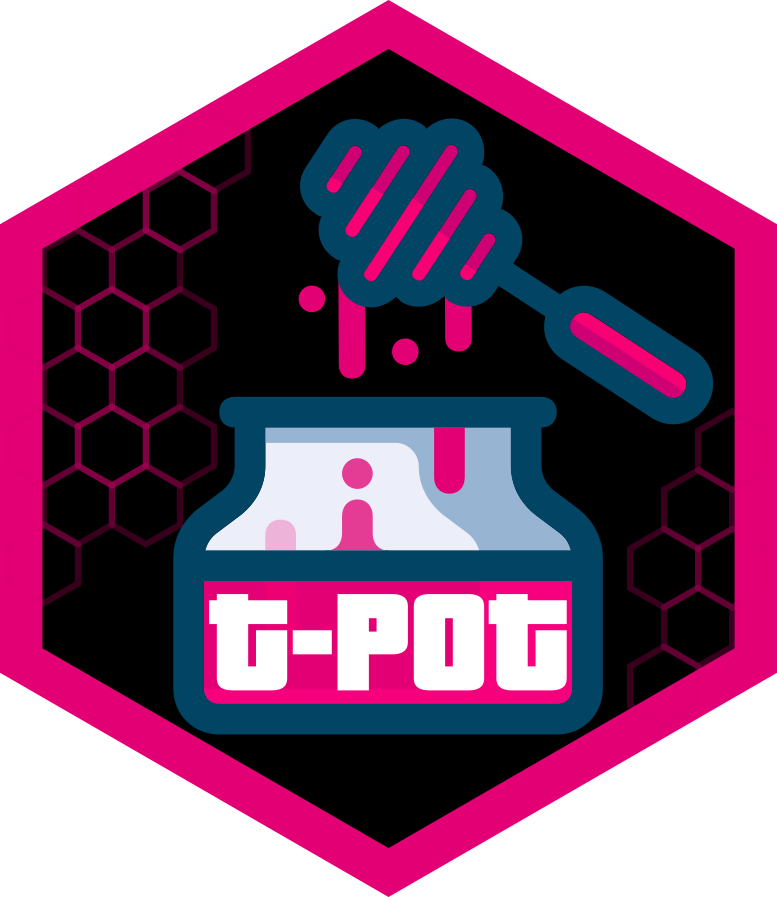

# SotyPot - Plataforma de Honeypots para ASIR



SotyPot es una plataforma de honeypots basada en T-Pot CE, desarrollada por **@Davidhernan3** como proyecto de fin de grado para el ciclo formativo de ASIR (Administración de Sistemas Informáticos en Red).

## 📝 Sobre el Proyecto

SotyPot es una modificación de [T-Pot CE](https://github.com/telekom-security/tpotce) adaptada con:
- Interfaz web personalizada en español
- Integración de herramientas adicionales  
- Mejoras en visualización de datos
- Optimización para entornos académicos

**Características principales:**
- Más de 20 honeypots integrados
- Panel de visualización con Kibana
- Mapa de ataques en tiempo real
- Herramientas de análisis de seguridad
- Interfaz adaptada para uso educativo

## ⚙️ Requisitos Técnicos

| Componente | Requisito Mínimo |
|------------|------------------|
| CPU        | 4 núcleos        |
| RAM        | 8GB              |  
| Almacenamiento | 128GB SSD    |
| SO         | Linux 64-bit     |
| Conexión   | Internet sin filtros |

## 🚀 Instalación Rápida

1. **Prepara el sistema**:
   ```bash
   sudo apt update && sudo apt install -y curl
   ```

2. **Ejecuta el instalador**:
   ```bash
   env bash -c "$(curl -sL https://github.com/Davidhernan3/sotypot/raw/main/install.sh)"
   ```

3. **Sigue las instrucciones** y reinicia el sistema cuando finalice.

## 🛠 Honeypots Integrados

SotyPot incluye los siguientes honeypots basados en T-Pot:

| Honeypot       | Protocolos       | Descripción                     |
|----------------|------------------|---------------------------------|
| Cowrie         | SSH, Telnet      | Emula sistemas Linux            |
| Dionaea        | Múltiples        | Captura malware                 |
| ElasticPot     | Elasticsearch    | Detecta escaneos ES             |
| AdbHoney       | Android Debug    | Emula dispositivos Android      |
| Wordpot        | HTTP             | Detecta escaneos WordPress      |

*(Lista completa disponible en la documentación técnica)*

## 🔧 Configuración Avanzada

### Personalización de Honeypots
Para modificar la configuración de los honeypots:
1. Edita los archivos YAML en `tpotce-master/docker/[nombre_honeypot]/`
2. Reinicia el contenedor: `docker restart [nombre_contenedor]`

### Variables de Entorno
Puedes configurar:
- `TPOT_FLAVOR`: Tipo de instalación (standard, mini, etc.)
- `TPOT_OSTYPE`: Tipo de SO (linux, mac, win)
- `LS_SSL_VERIFICATION`: Verificación SSL para Logstash

Ejemplo:
```bash
echo "TPOT_FLAVOR=standard" >> ~/tpotce/.env
```

## 🐛 Solución de Problemas

### Problemas Comunes
1. **Contenedores no inician**:
   - Verifica logs: `docker logs [nombre_contenedor]`
   - Revisa conflictos de puertos: `netstat -tulnp`

2. **Problemas de red**:
   - Verifica que el firewall permite los puertos necesarios
   - Comprueba que Docker tiene permisos de red

3. **Problemas de almacenamiento**:
   - Los logs se almacenan en `~/tpotce/data`
   - Configura rotación de logs si es necesario

## ❓ FAQ de SotyPot

**Q: ¿Cómo accedo a Kibana?**  
A: https://[tu-ip]:64297 con credenciales de webuser

**Q: ¿Cómo actualizo SotyPot?**  
A: Ejecuta `~/tpotce/update.sh`

**Q: ¿Dónde se almacenan los datos capturados?**  
A: En Elasticsearch, accesible via Kibana

**Q: ¿Cómo personalizo el dashboard?**  
A: Exporta/importa objetos Kibana desde la interfaz

## 🌐 Acceso Web

Tras la instalación, accede a la interfaz web en:
```
https://<tu-ip>:64297
```

Credenciales:
- Usuario: `webuser` (o el configurado)
- Contraseña: La establecida durante la instalación

## 📚 Documentación Técnica

Para detalles técnicos completos, consulta:
- [Arquitectura del sistema](doc/architecture.png)
- [Puertos requeridos](#puertos-requeridos)
- [Configuración avanzada](#configuración)

## 👥 Créditos y Licencia

Este proyecto está basado en [T-Pot CE](https://github.com/telekom-security/tpotce) de Telekom Security, bajo licencia GPLv3.

**Desarrollador principal**:  
👨‍💻 David Hernández ([@Davidhernan3](https://github.com/Davidhernan3))  
📧 contacto@davidhernandez.dev  

**Modificaciones principales**:
- Interfaz web personalizada
- Integración de herramientas adicionales
- Documentación en español  
- Optimizaciones para entornos educativos

## 📄 Licencia

```
Copyright (C) 2025 David Hernández
Copyright (C) 2024 Telekom Security

Este programa es software libre: puedes redistribuirlo y/o modificarlo
bajo los términos de la GNU General Public License publicada por
la Free Software Foundation, ya sea la versión 3 de la Licencia, o
(a tu elección) cualquier versión posterior.
